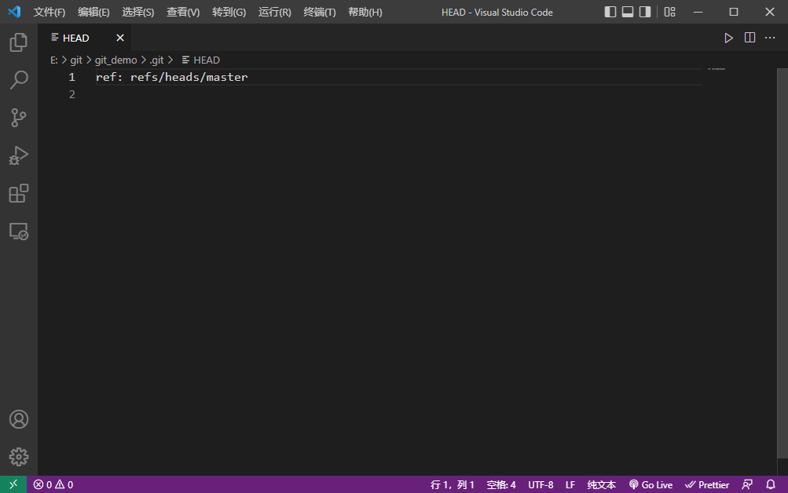

# git

## git概述

*分布式版本控制工具（vs集中式版本控制工具）*

​	git ： 免费开源的**分布式版本控制系统**，可以快速高校地处理从小型到大型的各种项目

​	git易于学习，占地面积小，性能极快。具有廉价的本地库，方便的暂存区域和多个工作流分支等特性。

[官网](https://git-scm.com/) 

### 版本控制

**何为版本控制**

​	版本控制是一种记录文件内容变化，以便将来查阅特定版本修订情况的系统

​	版本控制其实最重要的是可以记录文件修改历史记录，从而让用户能够查看历史版本，方便版本切换

**为什么需要版本控制**

### 版本控制工具

#### 集中式版本控制工具

svn……

​	集中式版本控制工具都有一个集中管理的服务器，保存所有文件的修订版本，而协同工作的人都通过客户端连接到这台服务器，取出最新的文件或者提交更新

缺点：中央服务器的单点故障问题

#### 分布式版本控制工具

git……

​	客户端提取的不是最新版本的文件快照，而是把代码仓库完整地镜像下来（本地库）。这样任何一处协同工作用的文件发生故障，时候都可以用其他客户端的本地仓库进行修复

解决了集中式版本控制工具的缺陷

### git发展历史

1. 1991——linus（linux创始人） 手动合并
2. 2002——Bitkeeper授权linux社区免费使用
3. 2005
   1. Andrew试图破解，收回使用权
   2. linus自己用c语言两周开发 git
4. 2008——github上线

### 工作机制

​	工作区—(git add)—暂存区—(git commit)—本地库—(push)—远程库

​	写代码——临时存储——历史版本

#### git和代码托管中心

​	代码托管中心是居于网络服务器的远程代码仓库，一般简单称之为远程库

- 局域网
  - gitlab
- 互联网
  - github
  - gitee

## git安装

[官网](https://git-scm.com/) 

## git命令

### 设置用户签名

```
git config --global user.name 自定义
git config --global user.email 自定义(虚拟邮箱)
```

检验：`C:\Users\Rei\.gitconfig`

**这里设置的用户签名和将来登录Github的账号没有任何关系**

### 初始化本地库

`git init`

```
Rei@DESKTOP-O9EU6JP MINGW64 /e/git/git_demo
$ git init
Initialized empty Git repository in E:/git/git_demo/.git/

//查看目录
Rei@DESKTOP-O9EU6JP MINGW64 /e/git/git_demo (master)
$ ll
total 0

//查看目录（含隐藏）
Rei@DESKTOP-O9EU6JP MINGW64 /e/git/git_demo (master)
$ ll -a
total 4
drwxr-xr-x 1 Rei 197121 0 Apr 19 18:33 ./
drwxr-xr-x 1 Rei 197121 0 Apr 19 18:34 ../
drwxr-xr-x 1 Rei 197121 0 Apr 19 18:33 .git/

```


### 查看本地库状态

`git status`

首次查看

```
Rei@DESKTOP-O9EU6JP MINGW64 /e/git/git_demo (master)
$ git status
On branch master

No commits yet

nothing to commit (create/copy files and use "git add" to track)
```


新增文件(hello.txt)

```
Rei@DESKTOP-O9EU6JP MINGW64 /e/git/git_demo (master)
$ vim hello.txt
//进入vim编辑文件hello.txt

Rei@DESKTOP-O9EU6JP MINGW64 /e/git/git_demo (master)
$ ll
total 1
-rw-r--r-- 1 Rei 197121 96 Apr 19 18:51 hello.txt

//查看文件内容
Rei@DESKTOP-O9EU6JP MINGW64 /e/git/git_demo (master)
$ cat hello.txt
hello git!
hello git!
hello git!
hello git!
esc 退出输入模式
yy 复制当前行
p 粘贴
最后一行

//查看文件最后一行内容
Rei@DESKTOP-O9EU6JP MINGW64 /e/git/git_demo (master)
$ tail -n 1 hello.txt
最后一行
```


再次查看

```
Rei@DESKTOP-O9EU6JP MINGW64 /e/git/git_demo (master)
$ git status
On branch master

No commits yet

Untracked files:
  (use "git add <file>..." to include in what will be committed)
        hello.txt

nothing added to commit but untracked files present (use "git add" to track)
```


### 添加暂存区

`git add`

```
//添加的单个文件
git add hello.txt

//添加多个文件，空格 隔开
git add hello.txt 2.txt

//添加文件夹内所有文件
git add .
```


​	`arning: LF will be replaced by CRLF in hello.txt.`

​	自动将win中的换行符`CRLF`转换成linux中的换行符格式`LF`

查看状态


#### 删除暂存区中的文件

`git rm --cached 文件名`


### 提交本地库

`git commit -m "日志信息" 文件名`


`[master (root-commit) 2597655] first commit`主干分支 first commit

`2597655`版本号

` 1 file changed, 8 insertions(+)` 1个文件被改变，8行内容被插入

**查看版本信息**

`git reflog`

`git log`查看详细日志


`25976556819f034a191db38374b9a4b6181de2e2`完整的版本号

### 修改文件


### 版本穿梭

`git reset --hard 版本号`


`E:\git\git_demo\.git\HEAD`



`E:\git\git_demo\.git\refs\heads\master`


## git分支

~~分支特性 分支创建 分支转换 分支合并 代码合并冲突解决~~

企业服务器运行模式


### 什么是分支

​	在版本控制过程中， 同时推进多个任务，可以为每个任务创建单独的分支。使用分支意味着程序员可以把自己的工作从开发主线上分离开来，开发自己分支的时候，不会影响主线分支的运行。（分支底层其实也是指针的引用）


### 分支的好处

​	同时并行推进多个功能开发，提高开发效率。

​	各个分支在开发过程中，如果某一个分支开发失败，不会对其他分支有任何影响。失败的分支山删除重新开始即可。 

### 分支的操作

| 命令名称            | 作用                         |
| ------------------- | ---------------------------- |
| git branch 分支名   | 创建分支                     |
| git branch -v       | 查看分支                     |
| git checkout 分支名 | 切换分支                     |
| git merge 分支名    | 把指定的分支合并到当前分支上 |

#### 查看分支

`git branch -v`


#### 创建分支

`git branch 分支名`


#### 修改分支


#### 切换分支

`git checkout 分支名`


#### 合并分支

`git merge 分支名`


#### 产生冲突

​	产生冲突的原因：合并分支时，两个分支在同一个文件的同一个位置有两套完全不同的修改，git无法替我们决定使用哪一个，必须人为决定新代码的内容。


#### 解决冲突


合并后commit时不能带文件名


hot-fix分支中并没有被合并

## 团队协作

### 团队内协作


### 跨团队协作


***

# github

https://github.com/

## github操作

| 命令名称                           | 作用                                                     |
| ---------------------------------- | -------------------------------------------------------- |
| git remote -v                      | 查看当前虽有远程地址别名                                 |
| git remote add 别名 远程地址       | 起别名                                                   |
| git push 别名 分支                 | 推送本地分支上的内容到远程仓库                           |
| git clone 远程地址                 | 将远程仓库的内容克隆到本地                               |
| git pull 远程库地址别名 远程分支名 | 将远程仓库对于分支最新内容拉下来后与当前本地分支直接合并 |

### 创建远程库

**New repository**

#### 别名

`git remote -v`      (当前无别名)


`git remote add 别名 远程地址`


### 代码推送 push

`git push 别名 分支`


登录账号


push成功


### 代码拉取 pull

`git pull 远程库地址别名 远程分支名`


pull 自动提交本地库

### 代码克隆 clone

`git clone 远程地址`


clone公共库时本地无需登录账号~~win:凭据管理器~~

~~挂代理clone会超时？？？~~


clone会做以下操作：

- 拉取代码
- 初始化本地库
- 创建别名

### 团队内协作

push失败，没有权限


添加成员


复制`Pending Invite`邀请函


push成功


### 跨团队协作

fork

在线编辑


​	~~仅修改本地库~~

pull request


merge pull request

commit merge

合并完成


### SSH免密登录

`ssh-keygen -t rsa -C 用户邮箱`

-t : 指定加密算法

rsa : 非对称加密协议

-C : 描述


id_rsa : 私钥

id_rsa.pub : 公钥


***

# idea 集成git

## 配置git忽略文件

​	idea中存在一些特定文件与项目的实际功能无关，不参与服务器上部署运行。把他们忽略掉能够屏蔽IDE工具之间的差异。

**如何忽略**

创建规则文件`xxx.ignore`

​		原则上放在任何位置都可以，为了便于让`~/.gitconfig`文件引用，建议放在用户家目录下

​		模板：

```
# Compiled class file
*.class

# Log file
*.log

# BlueJ files
*.ctxt

# Mobile Tools for Java (J2ME)
.mtj.tmp/

# Package Files #
*.jar
*.war
*.nar
*.ear
*.zip
*.tar.gz
*.rar

hs_err_pid*

.classpath
.project
.settings
target
.idea
*.iml
```

在`.gitconfig`文件中引用忽略配置文件

```
[core]
	excludesfile = 文件地址
```

​	*文件地址要使用正斜线"/"而不是反斜线"\\"*

## 定位git程序

IDEA——settings——Version Control——Git

## 初始化本地库

VCS——Create Git Repository——OK

*添加被忽略的文件*

选中文件——右击——Git——Add

*添加新文件时会询问是否Add*


## **commit**

右击根文件夹——Git——Commit Directory

## 切换版本

### 查看历史版本

左下角——Git——Log

### 切换

右击想要的版本——Checkout Revison（改变head指针）

## 创建&切换分支

- 右击根目录——Git——New Branch

- 右下角点击分支——New Branch

  

## 合并分支

右下角点击分支——点击要合并的分支——Merge '分支2' into '分支1'

## 代码冲突

合并产生冲突


点击Merge

​	master——正常——hot-fix


修改后Apply

合并成功&自动提交

***

# idea集成github

### 设置github账号

settings——version control——github（如果没有检查插件是否下载）

登录方法

1. log in via github 直接登录 

2. log in with token

   github——settings——developer settings——personal access token(权限全选)

## 分享项目到github

Git——Github——Share Project on Github


设置远程库信息


分享成功


## push代码到远程库


或


或


默认使用https连接push


**使用ssh进行push**


## pull远程库代码合并本地库

​	push是将本地库代码推送到远程库，如果本地库代码跟远程库代码版本不一致，push操作会被拒绝。想要push成功，一i的那个要保证本地库的版本要比远程库的版本高。

​	==因此，在修改代码前，一定要先加插远程库跟本地代码的区别。如果本地的代码已经落后，一定要先pull拉取一下远程库的代码，将本地代码更新到最新以后，然后再修改，提交，推送。==


~~如果自动合并失败会涉及到手动解决冲突问题~~

## clone代码到本地


***

# gitee码云

## 创建远程库

## idea集成gitee

## gitee连接github进行代码的复制和迁移

***

# gitlab

## gitlab服务器搭建和部署

## idea集成gitlab

